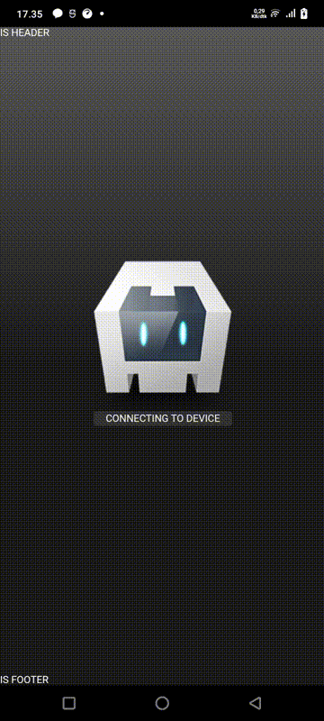
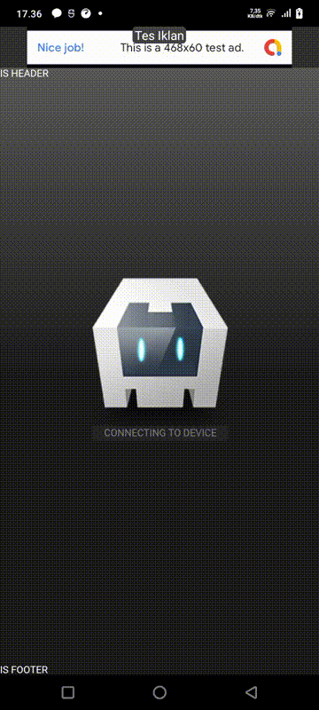
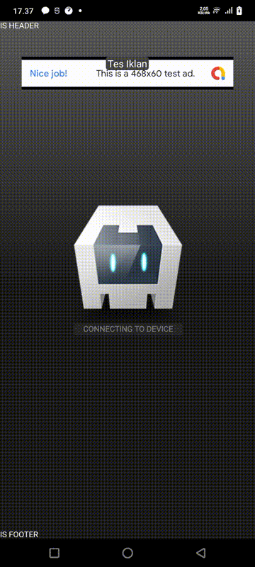
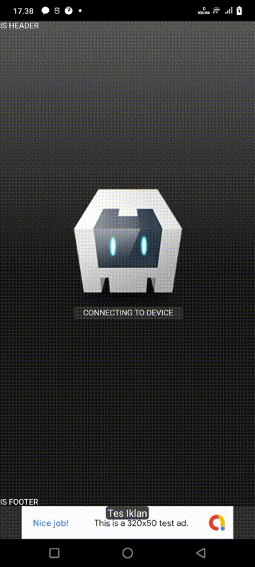
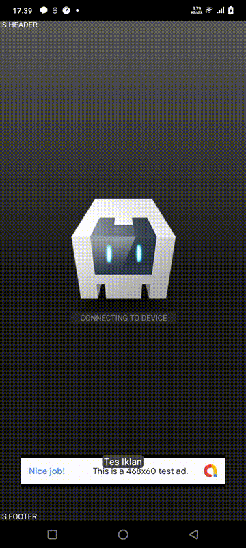

## Swipe Plugin for Cordova



### Platform Support
-------------------------------------------------------
- Android

### Overview

The Swipe plugin for Cordova provides a convenient way to add swipe refresh functionality to your Cordova applications. This plugin allows users to refresh the content of the application by performing a swipe gesture.

### Features

- **Swipe Refresh**: Users can refresh the content of the application by swiping down on the screen.
- **Customization**: Developers can customize various aspects of the swipe refresh functionality such as enabling/disabling, setting background color, defining swipe distance, and specifying colors.
- **Toast Notification**: Option to display toast notifications before or after refreshing the content.
- **JavaScript Action**: Ability to define a custom JavaScript action to be executed upon swipe refresh.


### Installation

To install the Swipe plugin into your Cordova project, use the following command:

```bash
cordova plugin add cordova-plugin-swipe-smooth
```

### Usage

After installing the plugin, you can utilize its functionality in your JavaScript code. Below is an example of how to use the Swipe plugin:

```javascript
// Initialize the Swipe plugin
cordova.plugin.swipe.smooth.initialize({
    isEnable: true,
    toastShow: true,
    toastText: "Refreshing...",
    jsAction: "window.location.reload()",
    backgroundColor: "#ffffff",
    distance: 200,
    colors: ["#000000"]
}).then(success => {
    if (success) {
        console.log("Swipe plugin initialized successfully");
    } else {
        console.error("Failed to initialize Swipe plugin");
    }
});

// Enable swipe refresh
cordova.plugin.swipe.smooth.enable();

// Customize options
cordova.plugin.swipe.smooth.backgroundColor({ backgroundColor: "#f0f0f0" });
cordova.plugin.swipe.smooth.textToast({ text: "Pull down to refresh" });
cordova.plugin.swipe.smooth.jsAction({ jsAction: "customRefreshFunction()" });
```

### API Reference

#### `initialize(options)`

Initializes the Swipe plugin with the specified options.

- `options`
    - `isEnable` : `boolean` default: `true`
    - `toastShow` : `boolean` default: `false`
    - `toastText` : `string` default: `"location reload"`
    - `jsAction` : `string` default: `"window.location.reload()"`
    - `backgroundColor` : `string` default: `"#ffffff"`
    - `colors` : `array` default: `["#000000"]`
    - `distance` : `int` default: `200`


#### `enable()`

Enables swipe refresh functionality.

- `options`
    - `enable` : `boolean`

#### `enableToast(options)`

Enables or disables toast notifications.

- `options`
    - `enable` : `boolean`

#### `textToast(options)`

Sets the text for the toast notification.

- `options`
    - `text` : `string`

#### `jsAction(options)`

Sets the JavaScript action to be executed upon swipe refresh.

- `options`
    - `jsAction` : `string`

#### `backgroundColor(options)`

Sets the background color of the swipe refresh layout.

- `options`
    - `backgroundColor` : `string`

#### `colors(options)`

Sets the colors for the swipe refresh animation.

- `options`
    - `colors` : `array`

#### `distance(options)`

Sets the distance in pixels the user must swipe to trigger a refresh.

- `options`
    - `distance` : `int`


### Usage with AdMob-Plus Plugin

If you are using the AdMob-Plus plugin to display ads, this plugin will not conflict when displaying banners. However, you may need to put some thought into preventing banners from being displayed repeatedly or stacked when the page is refreshed. You can try testing the plugin to use it simultaneously with AdMob-Plus.

### Screenshots

with admob plus banner top



with admob plus banner top offset 100



with admob plus banner bottom



with admob plus banner bottom offset 100




### Support

For any issues or feature requests, please [submit an issue](<issue-tracker-url>) on the GitHub repository.

### License

This plugin is licensed under the [MIT License](<license-url>).

---

Feel free to customize the README according to your project's needs. This template provides a basic structure to help you get started with documenting your Swipe plugin for Cordova.
